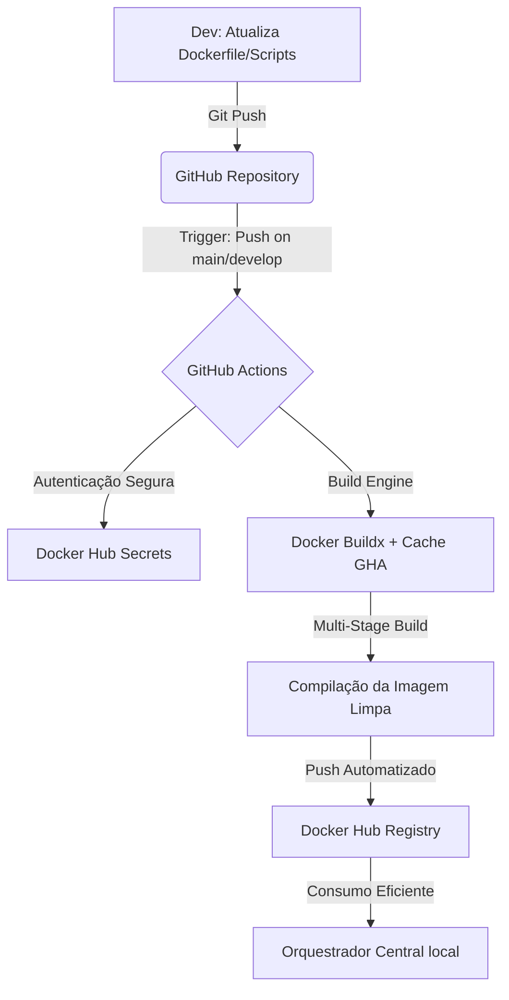

# Fábrica de Imagens Docker - TOTVS License Server

Este repositório é um componente isolado da arquitetura **TOTVS Protheus Modern DevOps**. Seu papel exclusivo é atuar como uma fábrica de imagens imutáveis, compilando o binário do License Server Virtual e publicando-o diretamente no Docker Hub via CI/CD.

## 🏗️ Fluxo de Arquitetura & Distribuição



### 🔑 Segurança e Governança de Variáveis (GitHub Secrets)

Para garantir conformidade com as melhores práticas de segurança de dados (`DevSecOps`), nenhuma credencial ou senha estática é armazenada no código-fonte. O `pipeline` consome variáveis injetadas dinamicamente em memória durante a execução através do `GitHub Repository Secrets`.

**Configuração das `Variáveis` no Painel do GitHub:**

Para que a esteira funcione, o repositório foi configurado seguindo o caminho: `Settings -> Secrets and variables -> Actions -> New repository secret`.

**`DOCKERHUB_USERNAME`**: Armazena o ID do proprietário do registro de contêineres.

**`DOCKERHUB_TOKEN`**: Um token de acesso programático (`PAT`) gerado no painel do `Docker Hub` (`Account Settings -> Security -> New Access Token`). O uso do Token em vez da senha real mitiga riscos de sequestro de credenciais (`Credential Stuffing`) e permite revogação imediata sem impacto.

### ⚙️ Funcionamento Interno do `Engine` de `Build` e `Cache`

O `pipeline` utiliza recursos avançados de orquestração de imagens para acelerar o tempo de entrega e garantir o isolamento:

1.**Compilação `Multi-Stage` (Dockerfile Otimizado)**

O processo de build é dividido em duas etapas para garantir uma imagem final enxuta e livre de vulnerabilidades apontadas por ferramentas de análise estática (como o SonarQube):

  * **Estágio 1 (Builder)**: Instala ferramentas de descompactação (`tar`), prepara o ambiente de runtime Java e executa o instalador oficial de forma silenciosa. Todo o lixo residual de compilação e arquivos .tar.gz morrem neste estágio.

  * **Estágio 2 (Runner)**: Uma imagem Ubuntu limpa que herda estritamente os binários processados pelo `Builder`. Consolida instruções `RUN` para diminuir as camadas físicas (`layers`) no disco e garantir um tamanho reduzido para transferência na rede.

2.**Gerenciamento Adaptativo de Cache (`type=gha`)**

Configurado com as diretivas `cache-from: type=gha` e `cache-to: type=gha,mode=max`.

  * O `Docker Buildx` exporta as camadas imutáveis do sistema operacional diretamente para a memória de armazenamento do `GitHub Actions`.

  * Em builds subsequentes, se não houver alteração nos pacotes do sistema, o Docker ignora o download e o processamento do `apt-get`, executando o pipeline em segundos.

3.**Ciclo de Vida do Runner Efêmero**

O build é processado de forma isolada (`ubuntu-latest`). Assim que o `push` para o `Docker Hub` é concluído, o GitHub destrói completamente o ambiente do runner, garantindo que nenhum resíduo ou binário proprietário fique exposto em servidores de terceiros.

### 🚀 Como Utilizar Localmente (Build Manual)

Caso precise homologar alterações ou validar o comportamento do contêiner antes de enviar o código para a esteira remota, execute os comandos abaixo na raiz deste repositório:

```bash
# 1. Garanta que o instalador oficial está presente na raiz (bloqueado pelo .gitignore)
# Nome esperado: license.tar.gz

# 2. Execute o build local atribuindo a tag correspondente
docker build -t rodrigomicrosiga/license-dev:3.7.1 .

# 3. Validar a execução local do container em modo standalone
docker run -d --name protheus_license_teste -p 5555:5555 rodrigomicrosiga/license-dev:3.7.1
```