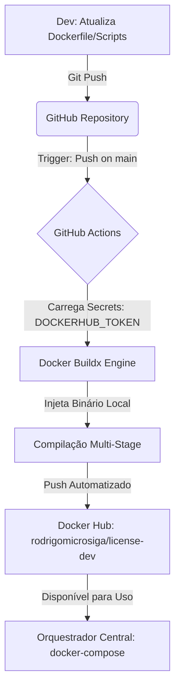

# Fábrica de Imagens Docker - TOTVS License Server

Este repositório é um componente isolado da arquitetura **TOTVS Protheus Modern DevOps**. Seu papel exclusivo é atuar como uma fábrica de imagens imutáveis, compilando o binário do License Server Virtual e publicando-o diretamente no Docker Hub via CI/CD.

## 🏗️ Fluxo de Arquitetura & Distribuição

